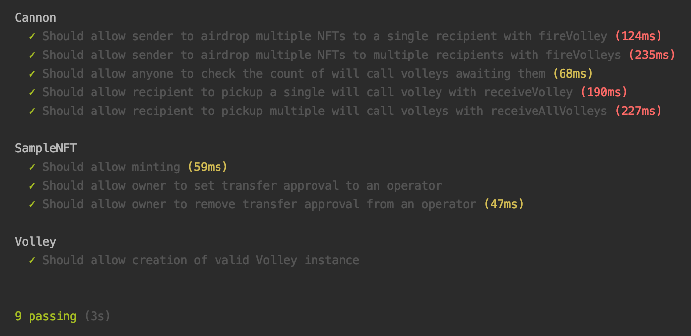
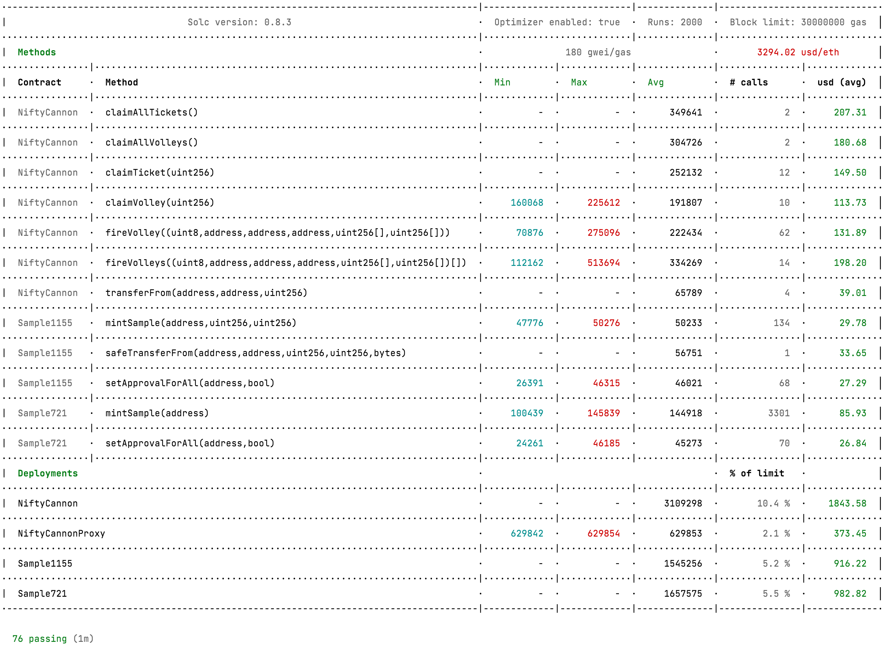
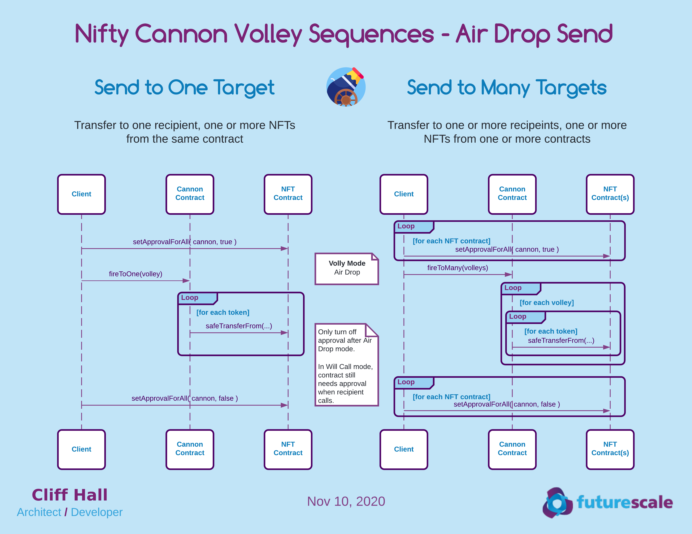
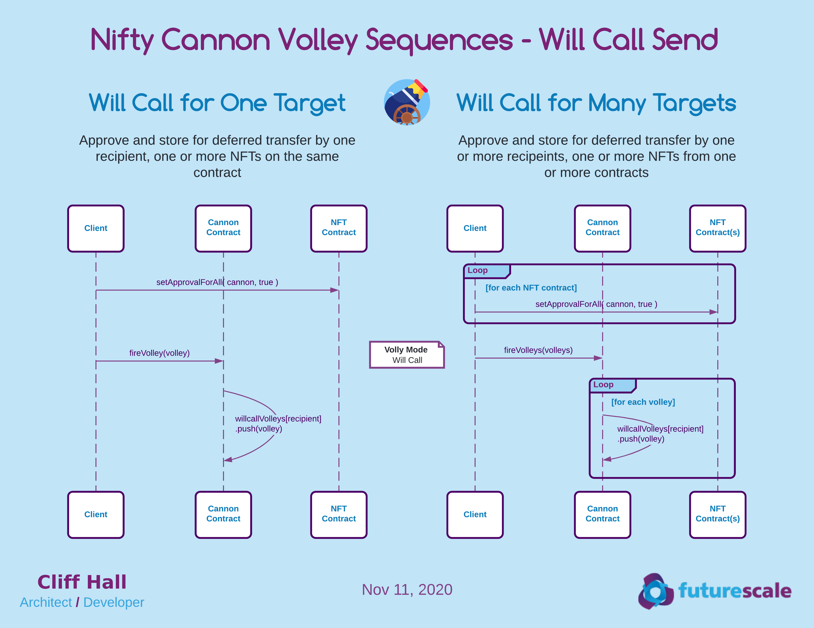
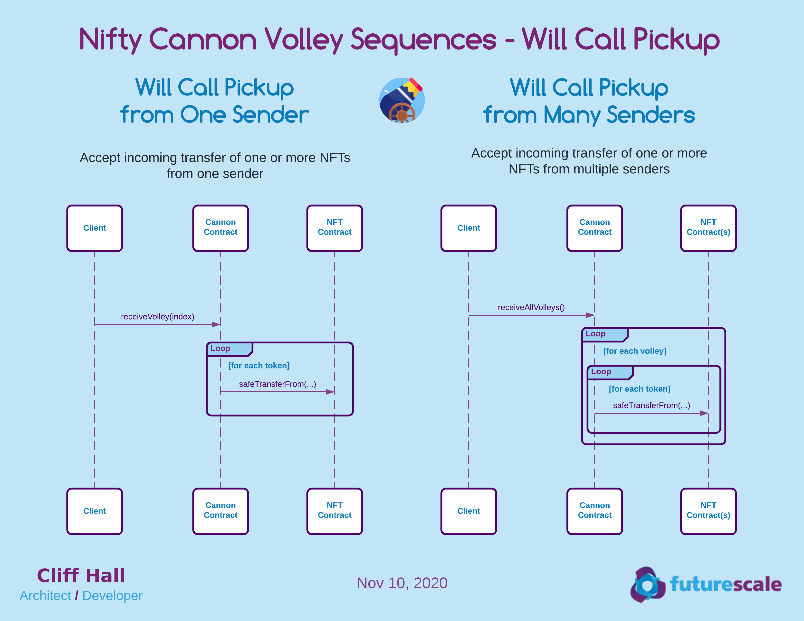
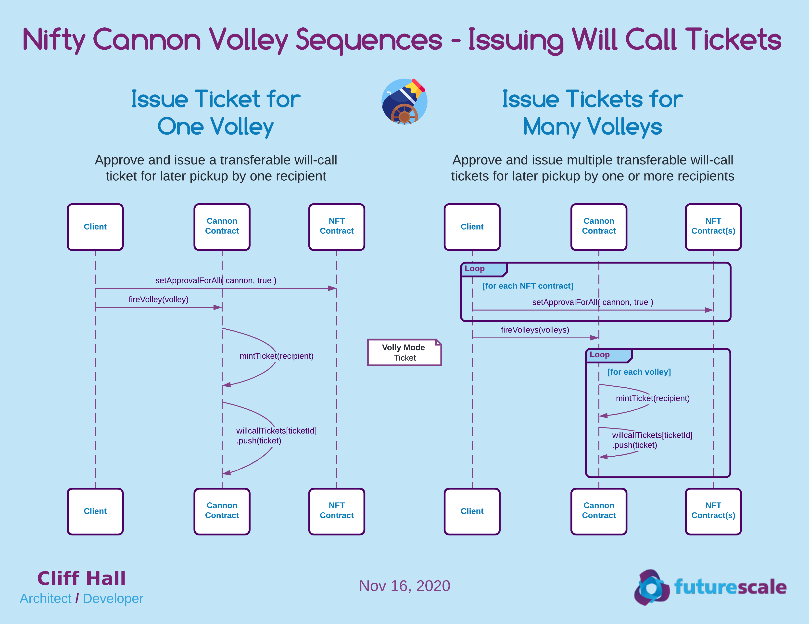
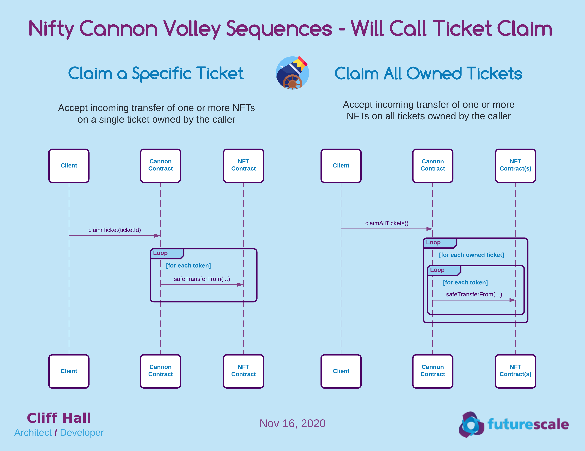

# Nifty Cannon Contracts


Make it rain NFTs!

Send multiple [ERC-721](http://erc721.org/) tokens from the same contract to multiple Ethereum addresses. 

## Features
* Airdrop mode 
  - sender pays gas for transfers
  - tokens are transferred immediately, from sender wallet to recipient wallets
  
* Will-call mode
  - sender fires same payload as airdrop, but it is stored rather than acted upon
  - recipient can pickup will-call NFTs any time
  - recipient pays gas for transfers when picking up

* Transferable Will-call Ticket mode
  - similar to will-call mode, except a will-call ticket is minted as an NFT, and transferred to the recipient
  - the current owner of the will-call ticket may pay the gas to receive the volleyed NFTs
  - if originally targeted recipient doesn't wish to pay gas to receive the NFTs, they can transfer or resell the ticket
  - helps avoid unclaimed will-call volleys; more volleyed NFTs will are likely to end up in the secondary market
  
* Rampart
  - anyone can register to opt out of receiving airdrops (Not MV)

## Status
Work in Progress
* Airdrops working and unit tested
* Non-transferable will-call working and unit tested
* Transferable will-call tickets working and unit tested
* Rampart functionality not MVP

### Unit Test Output


### Unit Test Gas Report


# Developer Setup
## Prerequisites
### Install Node (also installs NPM)
 * [Get Node](https://nodejs.org/en/download/)

### Install required Node modules
All NPM resources are project-local. No global installs required. 

```
cd path/to/nifty-cannon-contracts
npm install
```

### Configure Environment
Create a file called `environments.js` with the following content for each network environment.
* `forkNode`: the url endpoint for forking the ethereum network
* `forkBlock`: the block to fork the network ethereum from
* `txNode`: the endpoint for sending ethereum transactions
* `mnemonic`: a valid ethereum HD wallet seed phrase

```javascript
module.exports = {

    "rinkeby": {
        "forkNode": "https://eth-rinkeby.alchemyapi.io/v2/<YOUR_ALCHEMY_API_KEY>",
        "forkBlock": 7507432,
        "txNode": "https://rinkeby.infura.io/v3/<YOUR_INFURA_API_KEY>",
        "mnemonic": "<YOUR_UNIQUE_TWELVE_WORD_WALLET_SEED_PHRASE>"
    }

};
```

# Development Tasks
## NPM Scripts
### Build the contracts
This creates a the build artifacts for deployment or testing

```npm run build```

### Test the contracts
This builds the contracts and runs the unit tests.

```npm run test```

# Architecture
## Discussion
Initial MVP allows an owner of one or more NFTs on a contract to send a set of them to one or more recipients.

* NFT standard support
  - ERC721 support initially
  - ERC1155 eventually may help gas with batch transfer mode

### Terminology
* Volley
  - A set of NFTs on a single contract destined for a single recipient
    
* Airdrop Send
  - The immediate transfer of the NFTs in a Volley
  
* Will-call Send
  - The deferred transfer of the NFTs in a Volley for a recipient to pickup later
  
* Will-call Ticket
  - A transferable version of Will-call Send where an NFT is issued. Current owner can pickup
  
* Will-call Pickup
  - A recipient initiating a previously approved airdrop to their wallet

## Diagrams
### Volley Sequences - Air Drop Send


### Volley Sequences - Will-call Send (non-transferable)


### Volley Sequences - Will-call Pickup (non-transferable)


### Volley Sequences - Issuing Will-call Tickets (transferable)


### Volley Sequences - Will-call Ticket Claim


# Attributions
* Cannon icon made by <a href="https://www.flaticon.com/authors/freepik" title="Freepik">Freepik</a> from <a href="https://www.flaticon.com/" title="Flaticon">www.flaticon.com</a></div>
* Vintage Circus Cannon 3D model made by <a href="https://3docean.net/user/fainods">FainoDS</a> licensed from  <a href="https://3docean.net/">3dOcean</a>