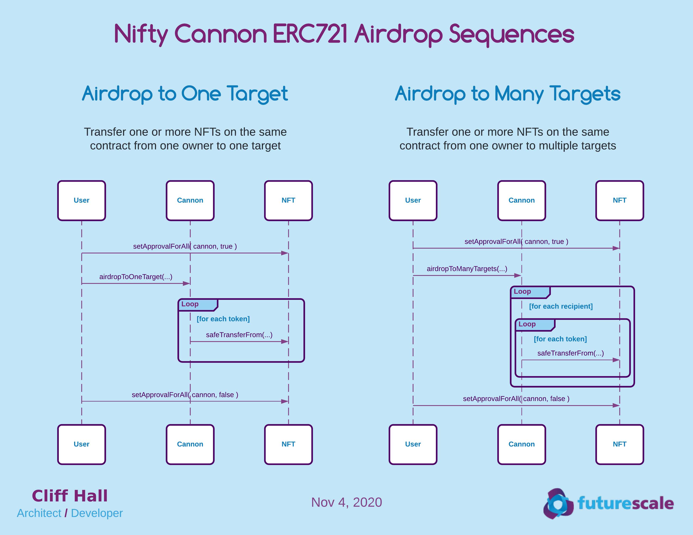

# Nifty Cannon Contracts

Make it rain NFTs!

Send multiple [ERC-721](http://erc721.org/) tokens from the same contract to multiple Ethereum addresses. 

Supports
* Airdrop mode 
  - sender pays gas
  - tokens are transferred from sender wallet to recipient wallets
  
* Will-call mode
  - tokens are transferred to cannon contract 
  - recipient OR sender can claim held tokens
  - claimant pays gas when claiming token

# Architecture
## Diagrams
### ERC721 Airdrop Sequences

