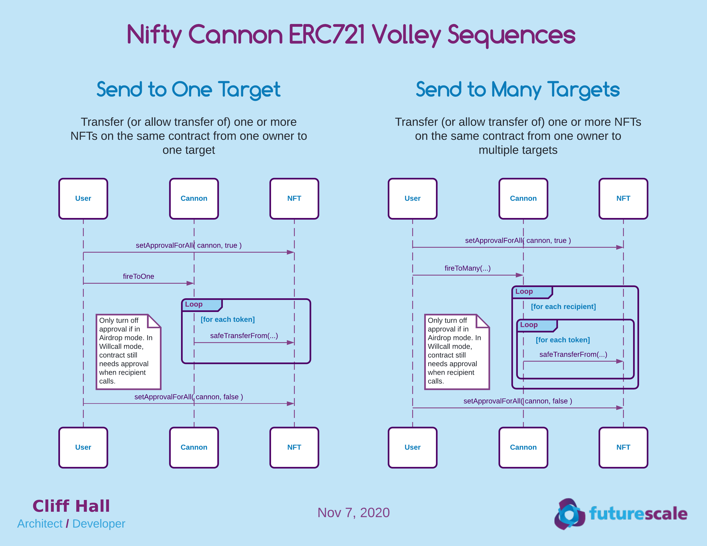

# Nifty Cannon Contracts

Make it rain NFTs!

Send multiple [ERC-721](http://erc721.org/) tokens from the same contract to multiple Ethereum addresses. 

Supports
* Airdrop mode 
  - sender pays gas
  - tokens are transferred from sender wallet to recipient wallets
  
* Will-call mode
  - claimant pays gas when claiming token
  
# Architecture
## Discussion
Initial MVP allows an owner of one or more NFTs on a contract to send a set of them to one or more recipients.

* NFT standard support
  - ERC721 support initially
  - ERC1155 eventually may help gas with batch transfer mode

### Terminology
* Volley
  - A set of NFTs on a single contract destined for a single recipient
  
* Fusillade
  - A set of Volleys
  
* Airdrop
  - The immediate transfer of the NFTs in a Volley
  
* Will Call Pickup
  - A recipient initiating a previously approved airdrop to their wallet

## Diagrams
### ERC721 Volley Sequences

### ERC721 Will Call Pickup Sequences

