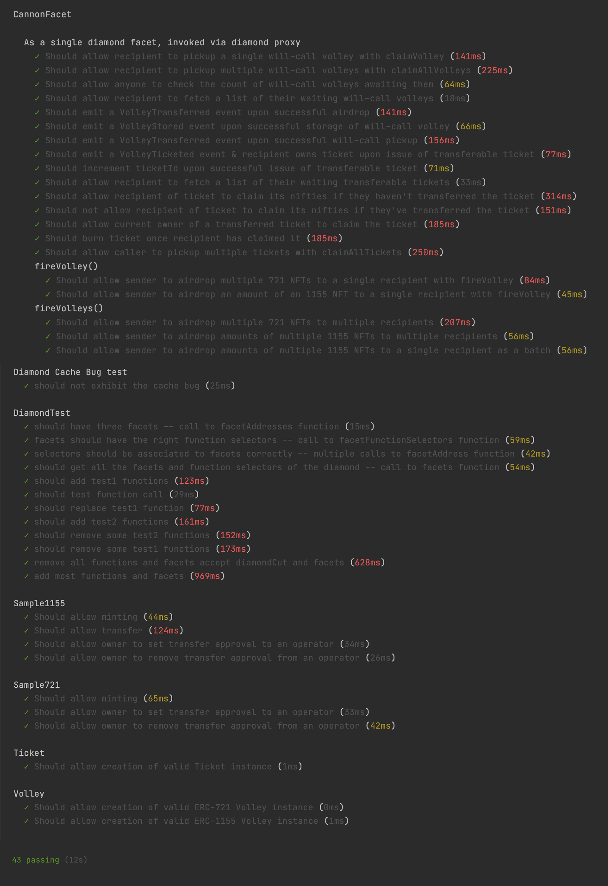

# Nifty Cannon Contracts


Make it rain NFTs!

Send multiple [ERC-721](https://eips.ethereum.org/EIPS/eip-721) tokens to multiple Ethereum addresses. 

Send amounts of multiple [ERC-1155](https://eips.ethereum.org/EIPS/eip-1155) tokens to multiple Ethereum addresses.

## Features
* Airdrop mode 
  - sender pays gas for transfers
  - tokens are transferred immediately, from sender wallet to recipient wallets
  
* Will-call mode
  - sender fires same payload as airdrop, but it is stored rather than acted upon
  - recipient can claim will-call NFTs any time
  - recipient pays gas for transfers when claiming

* Transferable Ticket mode
  - similar to will-call mode, except a ticket is minted as an NFT, and transferred to the recipient
  - the current owner of the ticket may pay the gas to receive the volleyed NFTs
  - if originally targeted recipient doesn't wish to pay gas and receive the NFTs, they can transfer or resell the ticket
  - helps avoid unclaimed will-call volleys; more volleyed NFTs will are likely to end up in the secondary market
  
* Rampart (Not in MVP)
  - anyone can register to opt out of receiving airdrops

## Status
* Airdrops working and unit tested
* Will-call volleys working and unit tested
* Transferable tickets working and unit tested
* ERC-721 support working and unit tested
* ERC-1155 support working and unit tested

### Unit Test Output


### Unit Test Gas Report


# Developer Setup
## Prerequisites
### Install Node (also installs NPM)
 * [Get Node](https://nodejs.org/en/download/)

### Install required Node modules
All NPM resources are project-local. No global installs required. 

```
cd path/to/nifty-cannon-contracts
npm install
```

### Configure Environment
Create a file called `environments.js` with 
- The following info for each Ethereum network environment.
  * `forkNode`: the url endpoint for forking the ethereum network
  * `forkBlock`: the block to fork the network ethereum from
  * `txNode`: the endpoint for sending ethereum transactions
  * `mnemonic`: a valid ethereum HD wallet seed phrase

- The following info for interacting with Etherscan and Coinmarketcap:
  * `etherscan.apiKey`: your etherscan API key
  * `coinmarketcap.apiKey`: your coinmarketcap API key

```javascript
module.exports = {
    "etherscan": {
        "apiKey": "<YOUR_ETHERSCAN_API_KEY>"
    },

  "coinmarketcap": {
    "apiKey": "<YOUR_COINMARKETCAP_API_KEY>"
  },

  "rinkeby": {
        "forkNode": "https://eth-rinkeby.alchemyapi.io/v2/<YOUR_ALCHEMY_API_KEY>",
        "forkBlock": 7507432,
        "txNode": "https://rinkeby.infura.io/v3/<YOUR_INFURA_API_KEY>",
        "mnemonic": "<YOUR_UNIQUE_TWELVE_WORD_WALLET_SEED_PHRASE>"
    }

};
```

# Development Tasks
## NPM Scripts
### Build the contracts
This creates a the build artifacts for deployment or testing

```npm run build```

### Test the contracts
This builds the contracts and runs the unit tests.

```npm run test```

### Deploy to Rinkeby
This deploys the built contracts to Rinkeby

```npm run deploy:rinkeby```


### Verify deployed contract with etherscan
```npx hardhat verify --network [rinkeby|mainnet] DEPLOYED_CONTRACT_ADDRESS```

# Architecture
## Discussion
Initial MVP allows an owner of one or more NFTs on a contract to send a set of them to one or more recipients.

* NFT standard support
  - ERC721 support initially
  - ERC1155 eventually may help gas with batch transfer mode

### Terminology
* Volley
  - A set of NFTs on a single contract destined for a single claimer
    
* Airdrop
  - The immediate transfer of the NFTs in one or more Volleys to one or more recipients
  
* Will-call
  - The a list of the NFTs in a Volley for a recipient to claim later
  
* Ticket
  - A transferable version of Will-call Volley where an NFT is issued. Current owner can claim
  
* Claim
  - A recipient receiving the previously approved NFTs to their wallet

## Diagrams
### Volley Sequences - Air Drop Send


### Volley Sequences - Will-call Send (non-transferable)


### Volley Sequences - Will-call Pickup (non-transferable)


### Volley Sequences - Issuing tickets (transferable)


### Volley Sequences - ticket Claim


# Attributions
* Cannon icon made by <a href="https://www.flaticon.com/authors/freepik" title="Freepik">Freepik</a> from <a href="https://www.flaticon.com/" title="Flaticon">www.flaticon.com</a></div>
* Vintage Circus Cannon 3D model made by <a href="https://3docean.net/user/fainods">FainoDS</a> licensed from  <a href="https://3docean.net/">3dOcean</a>